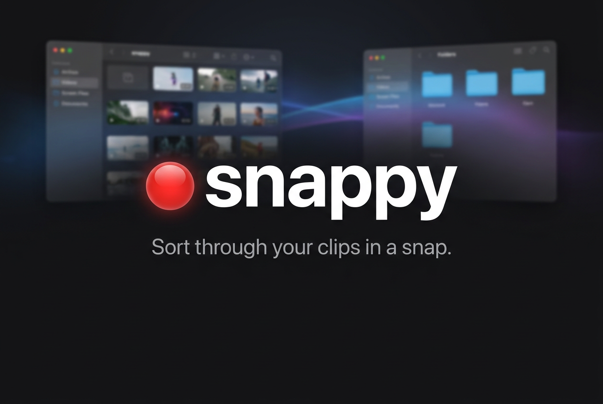

# Snappy 🔴

**Sort through your clips in a snap.** · *Talk to your footage.*

snappy is a macOS app that watches and listens to your video clips so you can find the right moment by *just asking for it*. Point it at a folder and it transcribes, tags, summarizes, and flags every clip automatically, then lets you chat with your whole library like it's a person who watched all of it.



---

## The problem

Anyone who vlogs ends up with folders full of unnamed clips like `IMG_4471.mov` or `final_v3_REAL.mp4`, with no idea what's inside without opening each one. Finding "the take where I nailed the intro" means scrubbing through dozens of files by hand. It's so tedious it makes you put off editing entirely (sometimes for a year, sometimes forever).

## What it does

Open a folder and snappy instantly:

- 🎙️ **Transcribes** every clip (Deepgram Nova-2)
- 🏷️ **Tags & summarizes** each one (Claude Sonnet 4)
- ⚠️ **Flags** filler words and repeated phrases so you can tighten your delivery
- 💬 **Chat** across your whole library, like *"Find the clip where I talk about pricing"*, and snappy takes you right there
- 🔍 **Search & filter** by tag, keyword, or flagged-only, and sort by name, length, or number of issues

No uploading, no renaming files, no manual logging. Just open a folder and talk to your footage.

## How it works

1. **Pick a folder.** Clips load in place (nothing copied or moved).
2. **Auto-index** per clip: extract audio (`ffmpeg`), transcribe (Deepgram), analyze fillers/repeats locally, then tag and summarize (Claude).
3. **Browse** a searchable list with tag chips, summaries, and ⚠️ badges.
4. **Dig in.** Open any clip for an inline-highlighted transcript (orange for repeated phrases, yellow for filler words).
5. **Ask.** Chat reasons across every clip to find exactly what you mean.

Results are cached locally with a stable hash, so reopening a folder is instant.

## Built with

**Languages:** Swift, TypeScript/JavaScript
**Framework / UI:** SwiftUI
**Platform:** macOS (built in Xcode)
**AI / APIs:** Anthropic Claude (Sonnet 4), Deepgram (Nova-2)
**Cloud:** Cloudflare Workers (API-key proxy)
**Tools:** ffmpeg
**Storage:** local JSON cache (stable-hash, on-device)

## Setup

```bash
# Requires ffmpeg
brew install ffmpeg

# Open in Xcode, then ⌘R
open snappy.xcodeproj
```

API requests route through a Cloudflare Worker that holds the `ANTHROPIC_API_KEY` and `DEEPGRAM_API_KEY`, so no keys ship in the app.

## Privacy & responsible AI

Privacy was our top priority since snappy handles personal footage:

- **Your clips never leave your machine.** snappy reads them in place and caches results **locally** on your device.
- Only the **audio transcript** is sent to our AI services. The video files themselves are never uploaded.
- **API keys stay server-side** in a Cloudflare Worker, so nothing sensitive ships in the app.
- **Efficient by design:** each clip is only processed once (cached), and filler/repeat detection runs locally to avoid unnecessary inference.
- snappy **assists creators, it doesn't replace them.** You stay in control, and since transcription accuracy varies across accents and audio, AI output is a verifiable starting point with the original clip always one click away.

## What's next

- A **video timeline view** that flags rough sections directly at their timestamps.
- **Integration with editing software** (iMovie, Premiere Pro, Final Cut, CapCut) so the AI can help cut and trim sections directly. Not just *finding* your moments, but helping you *edit* them.

## Links

- **Code:** https://github.com/abcdemilyfgh/ai-hackathon

---

*Built with ❤️ by two sisters who got tired of never finishing their vlogs.*

